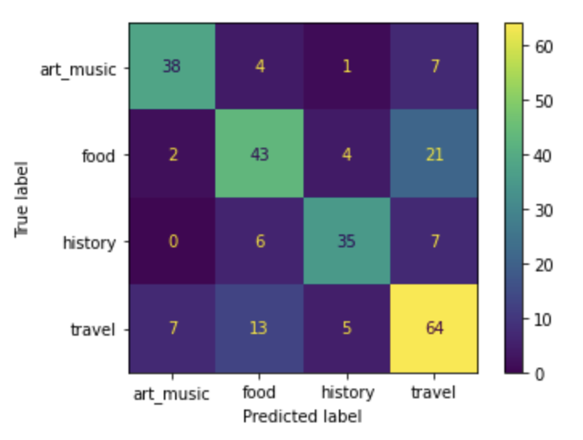

## Using NVIDIA embeddings from pretrained Speach-To-Text model for audio classification

## О работе

В рамках данной работы было необходимо классифицировать видеоролики из набора
данных [YouTube](https://www.kaggle.com/datasets/rajatrc1705/youtube-videos-dataset).
Набор данных содержит 3399 записей с информацией о различных видеороликах.
Задача заключается в том, чтобы классифицировать категорию видео по аудиодорожке.

## Решение

* Для решения поставленной задачи была использована модель для трансформации речи в
  текст [QuartzNet](https://catalog.ngc.nvidia.com/orgs/nvidia/resources/quartznet_for_pytorch).
  Предварительно по ссылкам из датасета были скачаны аудиодорожки, которые также были обрезаны по 60 секунд для более
  быстрой обработки аудио.
* Код, позволяющий скачать видео / аудио с youtube находится в файле [downloader.ipynb](downloader.ipynb), код
  обрезающий аудиодорожки находится в файле [preprocess.ipynb](preprocess.ipynb).
* С помощью **encoder** части модели QuartzNet были получены эмбеддинги для каждого из 3008 фрагментов входного аудио.
* Для получения векторного представления всего аудио, полученные векторы для фрагментов были усреднены. Таким образом
  для каждого аудио получили вектор из предобученной модели размерности 1024.
* Затем с помощью полносвязной нейронной сети решалась задача классификация на категории. На вход подавались полученные
  эмбеддинги, а на выходе получаем распределение над классами. Архитектура классификационной нейросети:
  ```python
  class AudioClassifier(nn.Module):
      def __init__(self, embedding_size: int, num_classes: int, dropout: float = 0.5):
        super().__init__()
        self.fc = nn.Linear(embedding_size, 256)
        self.tanh = nn.Tanh()
        self.drop = nn.Dropout(p=dropout)
        self.head = nn.Linear(256, num_classes)

      def forward(self, x):
          x = self.fc(x)
          x = self.tanh(x)
          x = self.drop(x)
          x = self.head(x)
    
          return x
  ```
  Важно отметить, что параметр dropout был 0.9, это позволило избежать переобучения на малом объеме данных и повысить
  обобщающую способность модели.

  Код обучения модели лежит в файле [train.ipynb](train.ipynb)

* Итоговая модель показала хорошее качество на многих примерах из тестовой части датасета. Accuracy / Precision / Recall
  на тестовой выборке составили больше 70%.

* Ниже представлен график confusion-matrix, можно заметить что модель часто ошибается в food и travel классах, что
  довольно логично, так как зачастую в фудблогах блогеры рассказывает про еду заграницей.



## Итог:

Предобученная модель QuarzNet – выдает достаточно качественные и информативные вектора, описывающие аудио. Такие вектора
можно использовать для дальнейшего решения задачи, также в данной работе модель QuarzNet не дообучалась.